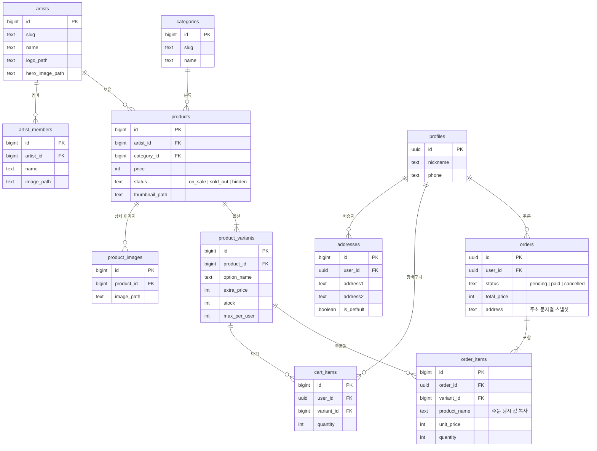

# KANT MOA — 아이돌 공식 굿즈샵

> 가상 아이돌 그룹 3팀 **ORBIT:ON(오르빗온) · DAYLOG(데이로그) · SODA FM(소다에프엠)** 의 공식 굿즈를 한곳에서 모아 보는 온라인 굿즈샵입니다.
> 팬이 메인에서 아티스트와 신상품을 둘러보고, 카테고리·아티스트별 목록에서 상품을 찾고, 상세 페이지에서 옵션(멤버·버전·사이즈)을 골라 장바구니에 담아 주문하는 흐름을 구현했습니다.

- **Use Case**: 의류/패션 편집숍형 쇼핑몰을 응용한 아이돌 굿즈 스토어
- **카테고리 (7)**: 앨범, 응원용품, 인형, 액세서리, 의류, 생활용품, 멤버십
- **팀**: KANT_MOA (4명) · 프로젝트 기간 4일

<!-- TODO: 배포 URL이 생기면 추가 -->

---

## 목차

1. [주요 기능](#1-주요-기능)
2. [기술 스택](#2-기술-스택)
3. [실행 방법](#3-실행-방법)
4. [화면 구성](#4-화면-구성)
5. [컴포넌트 구조도](#5-컴포넌트-구조도)
6. [폴더 구조](#6-폴더-구조)
7. [데이터 구조 (ERD)](#7-데이터-구조-erd)
8. [데이터 연동 방식](#8-데이터-연동-방식)
9. [과제 요구사항 대응](#9-과제-요구사항-대응)
10. [팀원과 역할](#10-팀원과-역할)
11. [협업 방식](#11-협업-방식)
12. [트러블슈팅](#12-트러블슈팅)

---

## 1. 주요 기능

| 영역 | 기능 |
|---|---|
| 둘러보기 | 메인(아티스트별 굿즈, 새로 나온 굿즈), 아티스트 페이지(배너·멤버 소개), 카테고리별 목록, 정렬(최신순·가격순), 더보기 |
| 상품 상세 | 대표·상세 이미지, 옵션 선택(멤버·버전·사이즈, 추가금), 수량 선택, 품절·1인 구매 제한 안내, 없는 상품 ID는 404 처리 |
| 장바구니 | 비회원도 담기 가능(브라우저 저장), 로그인하면 서버 장바구니로 자동 병합, 수량 변경·삭제, 품절 상품은 합계에서 제외 |
| 주문·결제 | 주문서(기본 배송지 자동 입력, 배송지 선택·추가), 테스트 결제, 결제 완료·주문 상세, 다시 결제, 주문 취소 |
| 마이페이지 | 주문/취소 내역(상태 탭), 배송 주소 관리(추가·수정·삭제·기본 지정), 내 정보 수정, 로그아웃 |
| 회원 | 회원가입, 로그인, 로그인 후 원래 보던 화면으로 돌아가기 |
| 반응형 | 상품 그리드 2→3→4열, 모바일 하단 내비게이션 |

> 실제 결제는 이루어지지 않습니다. "결제하기"를 누르면 결제 완료로 처리되는 **가짜 결제**입니다.

---

## 2. 기술 스택

| 영역 | 사용 기술 |
|---|---|
| 프레임워크 | Next.js 16 (App Router, `cacheComponents`), React 19 |
| 언어 | TypeScript 5 |
| 스타일 | Tailwind CSS 4 |
| 백엔드 (BaaS) | Supabase — Auth, Postgres, RLS(행 단위 권한), RPC(DB 함수), Storage |
| 배포 | Vercel (예정) |
| 협업 | GitHub (개인 브랜치 → develop PR), Notion, Slack |

---

## 3. 실행 방법

### 준비물

- Node.js 20 이상, npm
- Supabase 프로젝트의 URL과 Publishable(anon) 키

### 로컬 실행

```bash
git clone https://github.com/jin-park0115/KANT_MOA.git
cd KANT_MOA
npm install
cp .env.example .env.local
```

`.env.local`에 Supabase 값을 넣습니다. (팀원은 팀 채널에서 공유받은 값을 사용합니다.)

```bash
NEXT_PUBLIC_SUPABASE_URL=https://<project-ref>.supabase.co
NEXT_PUBLIC_SUPABASE_PUBLISHABLE_KEY=<publishable 또는 anon key>
```

```bash
npm run dev      # http://localhost:3000
```

### 그 밖의 명령어

```bash
npm run build    # 프로덕션 빌드 (타입 검사 포함)
npm run start    # 빌드 결과 실행
npm run lint     # ESLint
```

### 직접 Supabase 프로젝트를 만들어 실행하는 경우

1. Supabase에서 새 프로젝트를 만들고 URL·키를 `.env.local`에 넣습니다.
2. `supabase/migrations/`의 SQL을 **파일 이름 순서대로** 적용합니다. (Supabase CLI의 `supabase db push` 또는 SQL Editor)
3. `supabase/seed.sql`로 아티스트·카테고리·샘플 상품을 넣습니다.
   - `..._add_artist_members.sql`, `..._add_daylog_sodafm_products.sql`은 seed의 아티스트·카테고리가 있어야 데이터가 들어갑니다. 빈 DB라면 seed를 먼저 넣고 두 파일을 다시 실행하세요.
4. Storage의 `products`, `artists` 버킷에 이미지를 올립니다. (경로 규칙: `docs/DB_DESIGN.md`)

> `.env.local`은 커밋하지 않습니다. service role(secret) 키는 이 프로젝트에서 사용하지 않습니다.

---

## 4. 화면 구성

| 화면 | 경로 | 비고 |
|---|---|---|
| 메인 | `/` | 아티스트별 굿즈 캐러셀, 새로 나온 굿즈 |
| 아티스트 | `/artists/[slug]` | 배너, 아티스트 상품 목록 |
| 아티스트 소개 | `/artists/[slug]/about` | 멤버 카드 |
| 카테고리 목록 | `/category/[slug]` | 카테고리 탭, 정렬, 더보기 |
| 상품 상세 | `/products/[id]` | 동적 라우트, 없는 ID는 404 |
| 장바구니 | `/cart` | 비회원 가능 |
| 주문서 | `/checkout` | 로그인 필요 |
| 주문/취소 내역 | `/orders` | `?status=paid·pending·cancelled` 탭 |
| 결제 완료·주문 상세 | `/orders/[id]` | 다시 결제, 주문 취소 |
| 마이페이지 | `/mypage` | 메뉴 |
| 배송 주소 관리 | `/mypage/addresses` | |
| 내 정보 수정 | `/mypage/profile` | |
| 로그인 / 회원가입 | `/login`, `/signup` | `?next=` 로 원래 화면 복귀 |

### 사용자 흐름

```
메인 ─┬─ 아티스트 페이지 ─┐
      ├─ 카테고리 목록 ───┼─▶ 상품 상세 ─▶ 장바구니 ─▶ (로그인) ─▶ 주문서 ─▶ 결제 ─▶ 주문 상세
      └─ 새로 나온 굿즈 ──┘                                                        │
                                                         마이페이지 ◀─ 주문/취소 내역 ◀┘
```

### 완성 화면

<!-- TODO: docs/screenshots/ 에 캡처를 넣고 아래 표를 이미지로 바꿔주세요 -->

| 메인 | 상품 목록 | 상품 상세 |
|---|---|---|
| _캡처 예정_ | _캡처 예정_ | _캡처 예정_ |

| 장바구니 | 주문서 | 마이페이지 |
|---|---|---|
| _캡처 예정_ | _캡처 예정_ | _캡처 예정_ |

---

## 5. 컴포넌트 구조도

```
RootLayout (app/layout.tsx)
├─ AuthProvider                         로그인 상태 구독 (비회원 장바구니 자동 병합)
├─ Header
│  ├─ Logo
│  ├─ 장바구니 아이콘 링크
│  └─ AccountActions                    로그인 / 닉네임 · 로그아웃
├─ <main> (각 페이지)
├─ Footer
└─ MobileBottomNav                      모바일 하단 내비

메인 /
├─ ArtistShowcase (아티스트마다)
│  └─ ProductCarousel ─ ProductCard ─ ProductImage
└─ ProductGrid ─ ProductCard

아티스트 /artists/[slug]
├─ ArtistBanners ─ ArtistBannerCarousel
└─ ProductListSection
   ├─ SortTabs
   └─ ProductGrid ─ ProductCard

아티스트 소개 /artists/[slug]/about
└─ MemberCard (멤버마다)

카테고리 /category/[slug]
├─ CategoryTabs
└─ ProductListSection ─ SortTabs, ProductGrid ─ ProductCard

상품 상세 /products/[id]
├─ ProductImage
└─ ProductPurchasePanel
   ├─ OptionSelector
   ├─ QuantityStepper
   └─ 장바구니 담기 (useCart)

장바구니 /cart
└─ CartItemRow ─ QuantityStepper        (useCart)

주문서 /checkout
├─ AddressSummary / AddressFields       저장된 배송지 / 직접 입력
└─ Modal ─ AddressForm                  배송지 변경·추가

주문/취소 내역 /orders
└─ OrderList ─ OrderStatusBadge

주문 상세 /orders/[id]
└─ OrderDetail ─ OrderStatusBadge

마이페이지 /mypage, /mypage/profile, /mypage/addresses
└─ AddressForm, AddressSummary          배송 주소 관리

로그인 / 회원가입
└─ AuthShell ─ LoginForm / SignupForm

공용 UI (components/ui)
Button · Input · Card · Badge · Modal · EmptyState · SectionHeader · Skeleton
(로그인이 필요한 화면은 LoginRequired, 불러오기 실패는 LoadError)
```

---

## 6. 폴더 구조

```
KANT_MOA/
├─ docs/                    설계·협업 문서 (SETUP, FRONTEND, BACKEND, DB_DESIGN, API_SPEC, worklog)
├─ public/brand/            로고 등 고정 이미지
├─ supabase/
│  ├─ migrations/           테이블 · RLS · RPC · Storage 마이그레이션 (순서대로 적용)
│  └─ seed.sql              아티스트 · 카테고리 · 샘플 상품
└─ src/
   ├─ app/
   │  ├─ (auth)/            로그인 · 회원가입
   │  ├─ (shop)/            메인 · 아티스트 · 카테고리 · 상품 · 장바구니 · 주문 · 마이페이지
   │  └─ layout.tsx         공통 레이아웃
   ├─ components/
   │  ├─ layout/            Header · Footer · MobileBottomNav
   │  ├─ ui/                공용 UI
   │  ├─ product/           상품 카드 · 그리드 · 상세 구매 패널 · 아티스트 배너
   │  ├─ cart/              장바구니 행 · 수량 조절
   │  ├─ order/             주문 목록 · 상세 · 상태 배지 · 로그인 안내
   │  ├─ address/           배송지 입력 · 폼 · 표시
   │  ├─ auth/              로그인 · 회원가입 폼
   │  └─ providers/         AuthProvider
   ├─ hooks/useCart.ts      장바구니 상태 공유 훅
   ├─ services/             Supabase 호출 함수 (프론트는 여기만 사용)
   ├─ lib/supabase/         Supabase 클라이언트
   ├─ constants/            에러 메시지
   └─ types/                app.ts(화면용 타입), database.ts(DB 자동 생성 타입)
```

---

## 7. 데이터 구조 (ERD)

과제의 정적 데이터(`data/products.ts`) 대신 **Supabase(Postgres)** 에 데이터를 저장합니다. 상품 타입은 `src/types/app.ts`의 `ProductSummary` / `ProductDetail`로 정의했습니다.



- **재고·구매 제한은 옵션(variant) 단위**로 관리합니다. 옵션이 없는 상품도 '기본' 옵션 1개를 가집니다.
- **주문은 스냅샷**입니다. 상품명·옵션명·가격·배송지를 주문 시점 값으로 복사해, 나중에 상품이나 주소록이 바뀌어도 지난 주문은 그대로입니다.
- 이미지는 Storage에 저장하고 DB에는 **버킷 안의 경로**만 저장합니다.

자세한 정책과 SQL은 [`docs/DB_DESIGN.md`](docs/DB_DESIGN.md)를 참고하세요.

---

## 8. 데이터 연동 방식

별도 API 서버 없이, 컴포넌트는 **`src/services/`의 함수만** 호출하고 그 안에서 Supabase를 사용합니다.

```
[컴포넌트] ──▶ services/*.ts ──▶ Supabase
                                 ├─ 조회: 테이블 select (RLS로 보호)
                                 ├─ 장바구니: cart_items (본인 것만)
                                 └─ 주문·결제·취소·기본 배송지: RPC (DB 함수)
```

| 파일 | 주요 함수 |
|---|---|
| `products.ts` | `getArtists`, `getArtist`, `getArtistMembers`, `getCategories`, `getProducts`, `getProduct` |
| `auth.ts` | `signUp`, `signIn`, `signOut`, `getProfile`, `updateProfile`, `onAuthChange` |
| `cart.ts` | `getCart`, `addToCart`, `updateQuantity`, `removeFromCart` — 비로그인은 브라우저, 로그인은 DB를 같은 함수로 처리 |
| `orders.ts` | `createOrder`, `payOrder`, `cancelOrder`, `getOrders`, `getOrder` |
| `addresses.ts` | `getAddresses`, `createAddress`, `updateAddress`, `deleteAddress`, `setDefaultAddress` |

**보안 원칙**
- 카탈로그는 누구나 읽기만 가능하고, 장바구니·주문·배송지는 **본인 데이터만** 접근할 수 있습니다 (RLS).
- 가격·재고·구매 제한이 걸린 쓰기(`create_order`, `pay_order`, `cancel_order`)는 **DB 함수에서만** 처리합니다. 결제 금액은 클라이언트가 보낸 값이 아니라 DB가 계산합니다.

전체 명세: [`docs/API_SPEC.md`](docs/API_SPEC.md)

---

## 9. 과제 요구사항 대응

| No. | 요구사항 | 구현 내용 |
|---|---|---|
| 1 | 기획 및 범위 정의 | 아이돌 굿즈샵, 메인·목록·상세 + 장바구니·주문 흐름 |
| 2 | 개발 환경 | Next.js(App Router) + TypeScript + Tailwind CSS |
| 3 | 데이터 모델링 | 정적 `data/products.ts` 대신 Supabase DB(12개 테이블), 타입은 `src/types/app.ts` |
| 4 | 공통 컴포넌트 | `Header`, `Footer`, `ProductCard` + 공용 UI 8종 |
| 5 | 목록 동적 렌더링 | `ProductGrid`에서 `.map()`으로 카드 출력 (`/category/[slug]`, `/artists/[slug]`, 메인) |
| 6 | 상세 동적 라우팅 | `app/(shop)/products/[id]/page.tsx` |
| 7 | 클라이언트 네비게이션 | `next/link`의 `<Link>`로 페이지 이동 |
| 8 | 스타일링 | Tailwind Grid/Flex, `aspect-square` · `object-cover`, hover 효과 |
| 9 | 예외 처리 · 저장소 | 없는 상품 ID는 `notFound()`, `.gitignore`로 `node_modules` · `.next` · `.env*.local` 제외 |
| 10 | 문서화 · 발표 | 이 README, `docs/` 설계 문서 |

| 도전 과제 | 구현 내용 |
|---|---|
| A. 반응형 | 상품 그리드 2→3→4열, 모바일 하단 내비 |
| B. 장바구니 | 장바구니 담기·수량·삭제 + 주문·결제·주문 내역까지 확장 |
| C. Vercel 배포 | 진행 예정 |

> 과제의 제외 범위(DB, 로그인, 서버 장바구니)를 팀 목표에 맞춰 **확장 구현**했습니다. 필수 화면(메인·목록·상세)은 그대로 충족합니다.

---

## 10. 팀원과 역할

| 이름 | 역할 | 담당 |
|---|---|---|
| 황지나 (jina) | 프론트엔드 A | 공통 레이아웃(헤더·푸터·내비), 공용 UI, 디자인 토큰, 로그인·회원가입 |
| 장충만 (chungman) | 프론트엔드 B | 메인, 아티스트 페이지, 카테고리·상품 목록, 상품 상세 |
| 최성호 (sungho) | 프론트엔드 C | 장바구니(`useCart`), 주문서, 결제 완료·주문 상세, 주문/취소 내역, 마이페이지·배송지 관리, SODA FM 이미지 |
| 박진 (jin) | 백엔드 | Supabase 스키마 · RLS · RPC, `services/`, Storage, 저장소 관리 |

<!-- TODO: 이름·역할이 맞는지 팀에서 확인 -->

---

## 11. 협업 방식

- **브랜치**: `main`(배포) ← `develop`(통합) ← `dev/<이름>`(개인). 작업 전 매번 `develop`을 개인 브랜치에 병합
- **PR**: 기능 단위로 `dev/<이름>` → `develop`, 리뷰 1명 승인 후 Squash merge
- **담당 영역 분리**: 다른 사람 담당 파일·공용 파일(`layout.tsx`, `globals.css`, `package.json` 등)은 합의 후 수정 (`docs/FRONTEND.md`)
- **커밋 컨벤션**: `feat`, `fix`, `refactor`, `style`, `docs`, `chore`, `db`
- **작업 기록**: 코딩 에이전트를 사용한 작업은 `docs/worklog/<이름>.md`에 기록 (요청 → 한 일 → 결정 이유 → 멈춘 지점 → 남은 일)
- **API 계약**: 백엔드 준비 전에는 `docs/API_SPEC.md`와 같은 함수 형태의 mock으로 화면을 먼저 만들고, services가 올라오면 import만 교체

---

## 12. 트러블슈팅

### 새로고침하면 주문 상세가 스켈레톤에서 멈춤
- **상황**: `/orders/[id]`를 서버 컴포넌트에서 `await params` 후 클라이언트 컴포넌트에 넘겼더니, 빌드는 되지만 직접 접속·새로고침 시 화면이 로딩 상태로 멈춤
- **원인**: `cacheComponents`가 켜져 있으면 라우트 파라미터를 `<Suspense>` 안에서 읽어야 하는데, 이 구조에서는 Suspense 안쪽이 하이드레이션되지 않음
- **해결**: 페이지는 `<Suspense>`만 두고, 클라이언트 컴포넌트에서 `useParams()` / `useSearchParams()`로 읽도록 변경

### "상품 보러가기"가 404
- **상황**: 장바구니·주문 내역의 빈 화면 버튼이 `/category/all`로 연결
- **원인**: 전체 상품 페이지가 없고 `/category/[slug]`는 실제 카테고리만 받음
- **해결**: 상품을 둘러볼 수 있는 메인(`/`)으로 연결

### 장바구니 수량을 바꾸면 상품 순서가 바뀜
- **원인**: 비회원 장바구니 저장 시 항목을 지우고 끝에 다시 붙임
- **해결**: 제자리에서 수량만 바뀌도록 `services/cart.ts` 수정

### 헤더·상세·장바구니가 서로 다른 장바구니를 봄
- **해결**: `useCart`를 모듈 단위 상태 + `useSyncExternalStore`로 만들어 모든 컴포넌트가 같은 장바구니를 공유. 로그인·로그아웃 시 자동 새로고침

<!-- TODO: 팀원별 트러블슈팅 추가 -->

---

## 문서

| 문서 | 내용 |
|---|---|
| [`docs/SETUP.md`](docs/SETUP.md) | 초기 세팅, 브랜치·커밋·PR 규칙, 작업 기록 형식 |
| [`docs/FRONTEND.md`](docs/FRONTEND.md) | 프론트엔드 담당 영역과 작업 규칙 |
| [`docs/BACKEND.md`](docs/BACKEND.md) | 백엔드 작업 규칙 |
| [`docs/DB_DESIGN.md`](docs/DB_DESIGN.md) | ERD, 정책, 마이그레이션 SQL |
| [`docs/API_SPEC.md`](docs/API_SPEC.md) | services 함수 명세, 에러 코드 |
