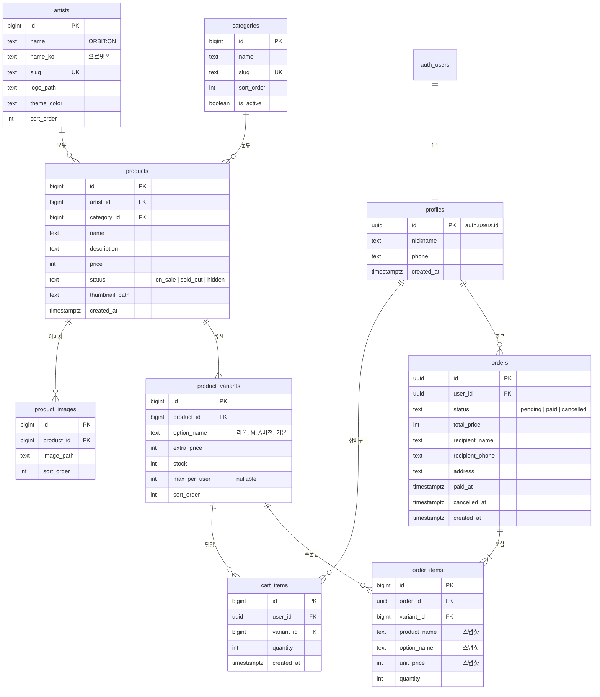
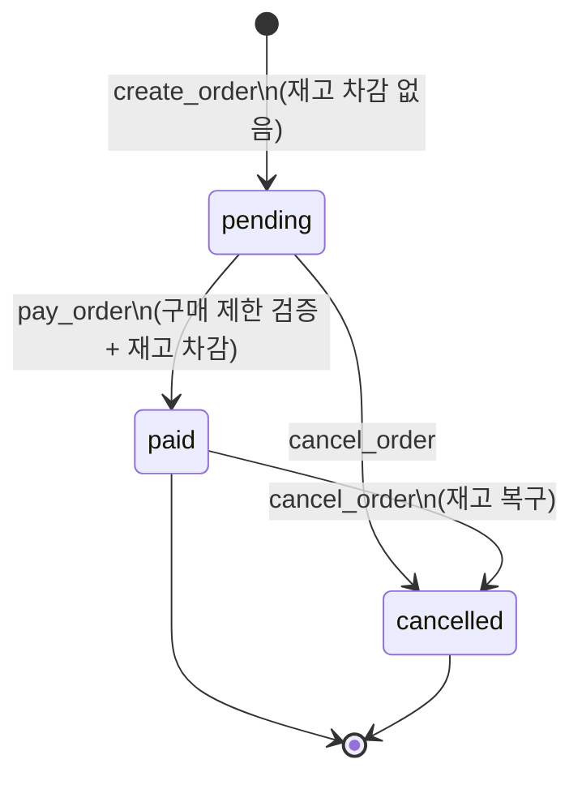
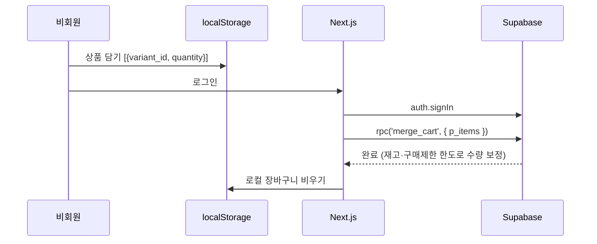

# 아이돌 굿즈샵 DB 설계 (Supabase)

## 1. 개요

- 대상: 아이돌 그룹 3개 ORBIT:ON(오르빗온), DAYLOG(데이로그), SODAFM(소다에프엠)의 굿즈샵

| 그룹 | slug | 멤버 |
|---|---|---|
| ORBIT:ON (오르빗온) | `orbit-on` | 리온, 선우, 이안, 제이, 하루 |
| DAYLOG (데이로그) | `daylog` | 지아, 희수, 혜주, 서연 |
| SODAFM (소다에프엠) | `sodafm` | 하람, 윤슬, 나래, 루하 |
- 스택: Next.js(프론트) + Supabase(Auth, Postgres, RLS, RPC)
- 별도 API 서버 없음. 돈·재고·구매 제한이 걸린 로직은 전부 **Postgres 함수(RPC)** 로 처리
- 결제는 가짜 결제("결제하기" 버튼 → paid)

## 2. 확정된 정책

| 항목 | 결정 |
|---|---|
| 회원 | Supabase Auth(`auth.users`) + `profiles` 1:1, 가입 시 트리거로 자동 생성 |
| 관리자 | **없음.** 아티스트·카테고리·상품·재고는 Supabase 대시보드 또는 seed SQL로 관리 (service role은 RLS를 우회) |
| 카테고리 | 7개 고정: 앨범, 응원용품, 인형, 액세서리, 의류, 생활용품, 멤버십. 고정이지만 표시 순서·URL slug·FK 무결성을 위해 `categories` 테이블로 관리 |
| 멤버별 굿즈 | 멤버 테이블 없이 variant `option_name`에 멤버 이름. 옵션 선택 시 메인 이미지는 바뀌지 않음 (variant 이미지 없음) |
| 이미지 | 상품·아티스트 이미지는 Supabase Storage(public 버킷). DB에는 전체 URL이 아닌 **버킷 내 경로**만 저장, URL은 services에서 `getPublicUrl()`로 생성. 로고·배너 등 디자인 고정 이미지는 프론트 `public/` |
| 멤버십 카드 | 일반 상품과 동일하게 처리. 아티스트별 상품 + variant `max_per_user = 1`. 멤버십 혜택(회원 전용 구매 등)은 범위 밖 |
| 옵션 | 사이즈·앨범 버전·멤버 모두 `product_variants`로 처리. 옵션 없는 상품도 '기본' variant 1개 보유 |
| 재고 | variant 단위로 관리 |
| 1인 구매 제한 | **옵션(variant)당 최대 개수** (`product_variants.max_per_user`, null이면 무제한) |
| 장바구니 | 비회원은 localStorage, 로그인 시 `merge_cart` RPC로 서버 장바구니에 병합 |
| 주문 | `create_order` 시 pending 생성, 재고 차감 없음 |
| 결제 | `pay_order` 시 구매 제한 검증 + 재고 차감 + paid 처리 + 장바구니에서 제거 |
| 취소 | pending은 상태만 변경, paid는 재고 복구 |
| 구매 제한 집계 기준 | status = 'paid'인 주문만 집계 |
| 상품 삭제 | 주문 이력 보존을 위해 삭제 대신 `status = 'hidden'` 사용 |

## 3. ERD



### 주요 제약

- `cart_items`: `UNIQUE (user_id, variant_id)` — 같은 옵션은 한 줄로 합쳐짐
- `order_items`: `UNIQUE (order_id, variant_id)` — 구매 제한 체크를 variant 단위로 단순하게 유지
- `product_variants`: `UNIQUE (product_id, option_name)`, `stock >= 0`
- `order_items`는 주문 당시 상품명·옵션명·가격을 스냅샷으로 저장 (상품 정보가 바뀌어도 주문 내역 유지)

## 4. 주문 상태 흐름



## 5. 장바구니 병합 흐름



---

## 6. 마이그레이션 SQL

### 6-1. 테이블

```sql
create table public.profiles (
  id uuid primary key references auth.users(id) on delete cascade,
  nickname text not null,
  phone text,
  created_at timestamptz not null default now()
);

create table public.artists (
  id bigint generated always as identity primary key,
  name text not null,
  name_ko text not null,
  slug text not null unique,
  logo_path text,          -- artists 버킷 내 경로
  theme_color text,
  sort_order int not null default 0,
  created_at timestamptz not null default now()
);

create table public.categories (
  id bigint generated always as identity primary key,
  name text not null,
  slug text not null unique,
  sort_order int not null default 0,
  is_active boolean not null default true
);

create table public.products (
  id bigint generated always as identity primary key,
  artist_id bigint not null references public.artists(id),
  category_id bigint not null references public.categories(id),
  name text not null,
  description text,
  price int not null check (price >= 0),
  status text not null default 'on_sale'
    check (status in ('on_sale', 'sold_out', 'hidden')),
  thumbnail_path text,     -- products 버킷 내 경로
  created_at timestamptz not null default now()
);

create table public.product_images (
  id bigint generated always as identity primary key,
  product_id bigint not null references public.products(id) on delete cascade,
  image_path text not null,  -- products 버킷 내 경로
  sort_order int not null default 0
);

create table public.product_variants (
  id bigint generated always as identity primary key,
  product_id bigint not null references public.products(id) on delete cascade,
  option_name text not null default '기본',
  extra_price int not null default 0 check (extra_price >= 0),
  stock int not null default 0 check (stock >= 0),
  max_per_user int check (max_per_user is null or max_per_user > 0),
  sort_order int not null default 0,
  unique (product_id, option_name)
);

create table public.cart_items (
  id bigint generated always as identity primary key,
  user_id uuid not null references public.profiles(id) on delete cascade,
  variant_id bigint not null references public.product_variants(id) on delete cascade,
  quantity int not null check (quantity > 0),
  created_at timestamptz not null default now(),
  unique (user_id, variant_id)
);

create table public.orders (
  id uuid primary key default gen_random_uuid(),
  user_id uuid not null references public.profiles(id),
  status text not null default 'pending'
    check (status in ('pending', 'paid', 'cancelled')),
  total_price int not null check (total_price >= 0),
  recipient_name text not null,
  recipient_phone text not null,
  address text not null,
  paid_at timestamptz,
  cancelled_at timestamptz,
  created_at timestamptz not null default now()
);

create table public.order_items (
  id bigint generated always as identity primary key,
  order_id uuid not null references public.orders(id) on delete cascade,
  variant_id bigint not null references public.product_variants(id),
  product_name text not null,
  option_name text not null,
  unit_price int not null check (unit_price >= 0),
  quantity int not null check (quantity > 0),
  unique (order_id, variant_id)
);

-- 인덱스
create index on public.products (artist_id);
create index on public.products (category_id);
create index on public.product_variants (product_id);
create index on public.orders (user_id, status);
create index on public.order_items (variant_id);
```

### 6-2. 회원가입 시 profiles 자동 생성

```sql
create or replace function public.handle_new_user()
returns trigger
language plpgsql
security definer
set search_path = public
as $$
begin
  insert into public.profiles (id, nickname)
  values (
    new.id,
    coalesce(new.raw_user_meta_data ->> 'nickname', split_part(new.email, '@', 1))
  );
  return new;
end;
$$;

create trigger on_auth_user_created
after insert on auth.users
for each row execute function public.handle_new_user();
```

프론트에서 가입 시 `options.data.nickname`으로 닉네임을 넘기면 그대로 저장됨.

### 6-3. RLS 정책

```sql
alter table public.profiles         enable row level security;
alter table public.artists          enable row level security;
alter table public.categories       enable row level security;
alter table public.products         enable row level security;
alter table public.product_images   enable row level security;
alter table public.product_variants enable row level security;
alter table public.cart_items       enable row level security;
alter table public.orders           enable row level security;
alter table public.order_items      enable row level security;

-- profiles: 본인만 조회/수정, 수정 가능한 컬럼은 nickname, phone으로 제한
create policy "profiles_select_own" on public.profiles
  for select to authenticated
  using (id = auth.uid());

create policy "profiles_update_own" on public.profiles
  for update to authenticated
  using (id = auth.uid())
  with check (id = auth.uid());

revoke update on public.profiles from authenticated;
grant update (nickname, phone) on public.profiles to authenticated;

-- 카탈로그: 누구나 조회만 가능. 쓰기 정책 없음 → 대시보드/seed SQL로만 관리
create policy "artists_select_all" on public.artists
  for select to anon, authenticated
  using (true);

create policy "categories_select_active" on public.categories
  for select to anon, authenticated
  using (is_active);

create policy "products_select_visible" on public.products
  for select to anon, authenticated
  using (status <> 'hidden');

create policy "product_images_select" on public.product_images
  for select to anon, authenticated
  using (exists (
    select 1 from public.products p
    where p.id = product_id and p.status <> 'hidden'
  ));

create policy "product_variants_select" on public.product_variants
  for select to anon, authenticated
  using (exists (
    select 1 from public.products p
    where p.id = product_id and p.status <> 'hidden'
  ));

-- 장바구니: 본인 것만 CRUD (구매 제한의 최종 검증은 pay_order에서)
create policy "cart_items_own" on public.cart_items
  for all to authenticated
  using (user_id = auth.uid())
  with check (user_id = auth.uid());

-- 주문: 본인 것 조회만 허용. INSERT/UPDATE 정책 없음 → RPC로만 변경 가능
create policy "orders_select_own" on public.orders
  for select to authenticated
  using (user_id = auth.uid());

create policy "order_items_select_own" on public.order_items
  for select to authenticated
  using (exists (
    select 1 from public.orders o
    where o.id = order_id and o.user_id = auth.uid()
  ));
```

### 6-4. RPC: merge_cart (비회원 장바구니 병합)

```sql
create or replace function public.merge_cart(p_items jsonb)
returns void
language plpgsql
security definer
set search_path = public
as $$
declare
  v_uid  uuid := auth.uid();
  v_item record;
  v_cap  int;
begin
  if v_uid is null then
    raise exception 'NOT_AUTHENTICATED';
  end if;

  for v_item in
    select (e ->> 'variant_id')::bigint      as variant_id,
           sum((e ->> 'quantity')::int)::int as quantity
    from jsonb_array_elements(p_items) e
    group by 1
  loop
    continue when v_item.quantity <= 0;

    -- 담을 수 있는 최대 수량 = min(재고, 옵션당 구매 제한)
    select least(pv.stock, coalesce(pv.max_per_user, pv.stock))
      into v_cap
    from product_variants pv
    join products p on p.id = pv.product_id
    where pv.id = v_item.variant_id
      and p.status = 'on_sale';

    continue when v_cap is null or v_cap <= 0;

    insert into cart_items (user_id, variant_id, quantity)
    values (v_uid, v_item.variant_id, least(v_item.quantity, v_cap))
    on conflict (user_id, variant_id)
    do update set quantity = least(cart_items.quantity + excluded.quantity, v_cap);
  end loop;
end;
$$;
```

### 6-5. RPC: create_order (pending 주문 생성, 재고 차감 없음)

```sql
create or replace function public.create_order(
  p_recipient_name  text,
  p_recipient_phone text,
  p_address         text
)
returns uuid
language plpgsql
security definer
set search_path = public
as $$
declare
  v_uid      uuid := auth.uid();
  v_order_id uuid;
  v_total    int;
begin
  if v_uid is null then
    raise exception 'NOT_AUTHENTICATED';
  end if;

  if not exists (select 1 from cart_items where user_id = v_uid) then
    raise exception 'CART_EMPTY';
  end if;

  -- 판매 중이 아니거나 재고가 부족한 항목 (사전 안내용 체크)
  if exists (
    select 1
    from cart_items c
    join product_variants pv on pv.id = c.variant_id
    join products p on p.id = pv.product_id
    where c.user_id = v_uid
      and (p.status <> 'on_sale' or pv.stock < c.quantity)
  ) then
    raise exception 'UNAVAILABLE_ITEM';
  end if;

  -- 구매 제한 초과 (사전 안내용 체크, 최종 검증은 pay_order)
  if exists (
    select 1
    from cart_items c
    join product_variants pv on pv.id = c.variant_id
    where c.user_id = v_uid
      and pv.max_per_user is not null
      and c.quantity + coalesce((
            select sum(oi.quantity)
            from order_items oi
            join orders o on o.id = oi.order_id
            where o.user_id = v_uid
              and o.status = 'paid'
              and oi.variant_id = c.variant_id
          ), 0) > pv.max_per_user
  ) then
    raise exception 'PURCHASE_LIMIT_EXCEEDED';
  end if;

  -- 가격은 클라이언트 값이 아닌 DB에서 계산
  select sum((p.price + pv.extra_price) * c.quantity)
    into v_total
  from cart_items c
  join product_variants pv on pv.id = c.variant_id
  join products p on p.id = pv.product_id
  where c.user_id = v_uid;

  insert into orders (user_id, total_price, recipient_name, recipient_phone, address)
  values (v_uid, v_total, p_recipient_name, p_recipient_phone, p_address)
  returning id into v_order_id;

  insert into order_items (order_id, variant_id, product_name, option_name, unit_price, quantity)
  select v_order_id, pv.id, p.name, pv.option_name, p.price + pv.extra_price, c.quantity
  from cart_items c
  join product_variants pv on pv.id = c.variant_id
  join products p on p.id = pv.product_id
  where c.user_id = v_uid;

  return v_order_id;
end;
$$;
```

### 6-6. RPC: pay_order (가짜 결제 + 재고 차감)

```sql
create or replace function public.pay_order(p_order_id uuid)
returns void
language plpgsql
security definer
set search_path = public
as $$
declare
  v_uid    uuid := auth.uid();
  v_item   record;
  v_bought int;
begin
  if v_uid is null then
    raise exception 'NOT_AUTHENTICATED';
  end if;

  -- 같은 사용자의 동시 결제를 직렬화 (구매 제한 우회 방지)
  perform 1 from profiles where id = v_uid for update;

  -- 본인의 pending 주문인지 확인 + 잠금 (결제 버튼 연타 방지)
  perform 1 from orders
  where id = p_order_id and user_id = v_uid and status = 'pending'
  for update;

  if not found then
    raise exception 'INVALID_ORDER';
  end if;

  -- variant_id 순서로 처리해 여러 결제 간 잠금 순서를 고정 (데드락 방지)
  for v_item in
    select oi.variant_id, oi.quantity, pv.max_per_user
    from order_items oi
    join product_variants pv on pv.id = oi.variant_id
    where oi.order_id = p_order_id
    order by oi.variant_id
  loop
    -- 옵션당 구매 제한
    if v_item.max_per_user is not null then
      select coalesce(sum(oi.quantity), 0)
        into v_bought
      from order_items oi
      join orders o on o.id = oi.order_id
      where o.user_id = v_uid
        and o.status = 'paid'
        and oi.variant_id = v_item.variant_id;

      if v_bought + v_item.quantity > v_item.max_per_user then
        raise exception 'PURCHASE_LIMIT_EXCEEDED'
          using detail = v_item.variant_id::text;
      end if;
    end if;

    -- 조건부 재고 차감 (동시 결제에도 음수 재고 방지)
    update product_variants
    set stock = stock - v_item.quantity
    where id = v_item.variant_id
      and stock >= v_item.quantity;

    if not found then
      raise exception 'OUT_OF_STOCK'
        using detail = v_item.variant_id::text;
    end if;
  end loop;

  update orders
  set status = 'paid', paid_at = now()
  where id = p_order_id;

  -- 결제된 옵션만 장바구니에서 제거
  delete from cart_items
  where user_id = v_uid
    and variant_id in (
      select variant_id from order_items where order_id = p_order_id
    );
end;
$$;
```

예외가 발생하면 함수 전체가 롤백되므로 재고가 일부만 차감되는 일은 없음.

### 6-7. RPC: cancel_order

```sql
create or replace function public.cancel_order(p_order_id uuid)
returns void
language plpgsql
security definer
set search_path = public
as $$
declare
  v_uid    uuid := auth.uid();
  v_status text;
begin
  if v_uid is null then
    raise exception 'NOT_AUTHENTICATED';
  end if;

  select status into v_status
  from orders
  where id = p_order_id and user_id = v_uid
  for update;

  if v_status is null then
    raise exception 'INVALID_ORDER';
  end if;

  if v_status = 'cancelled' then
    raise exception 'ALREADY_CANCELLED';
  end if;

  -- paid였던 주문만 재고 복구
  if v_status = 'paid' then
    update product_variants pv
    set stock = pv.stock + oi.quantity
    from order_items oi
    where oi.order_id = p_order_id
      and pv.id = oi.variant_id;
  end if;

  update orders
  set status = 'cancelled', cancelled_at = now()
  where id = p_order_id;
end;
$$;
```

### 6-8. 함수 실행 권한

```sql
revoke execute on function public.merge_cart(jsonb)              from public, anon;
revoke execute on function public.create_order(text, text, text) from public, anon;
revoke execute on function public.pay_order(uuid)                from public, anon;
revoke execute on function public.cancel_order(uuid)             from public, anon;

grant execute on function public.merge_cart(jsonb)              to authenticated;
grant execute on function public.create_order(text, text, text) to authenticated;
grant execute on function public.pay_order(uuid)                to authenticated;
grant execute on function public.cancel_order(uuid)             to authenticated;
```

### 6-9. Storage 버킷

```sql
-- public 버킷: URL로 누구나 읽기 가능
insert into storage.buckets (id, name, public) values
  ('products', 'products', true),
  ('artists',  'artists',  true);

-- 쓰기(INSERT/UPDATE/DELETE) 정책은 만들지 않음
-- → 업로드는 Supabase 대시보드(service role)에서만 가능
```

경로 규칙

```
products/
└─ <artist-slug>/<product-slug>/
   ├─ main.webp        # products.thumbnail_path
   └─ detail-1.webp    # product_images.image_path (sort_order 순)
artists/
└─ <artist-slug>/logo.webp
```

- 파일명은 영문 소문자·숫자·하이픈만 사용, 확장자는 `.webp` 권장
- 업로드 전 가로 1200px 이하로 리사이즈

### 6-10. 초기 데이터 (seed 예시)

관리자 기능이 없으므로 상품 등록·재고 수정은 SQL Editor에서 직접 실행합니다.

```sql
insert into public.artists (name, name_ko, slug, logo_path, sort_order) values
  ('ORBIT:ON', '오르빗온',   'orbit-on', 'orbit-on/logo.webp', 1),
  ('DAYLOG',   '데이로그',   'daylog',   'daylog/logo.webp',   2),
  ('SODAFM',   '소다에프엠', 'sodafm',   'sodafm/logo.webp',   3);

-- 카테고리는 고정 7개
insert into public.categories (name, slug, sort_order) values
  ('앨범',     'album',      1),
  ('응원용품', 'cheering',   2),  -- 응원봉, 슬로건 등
  ('인형',     'doll',       3),
  ('액세서리', 'accessory',  4),  -- 키링, 포토카드 홀더 등
  ('의류',     'apparel',    5),  -- 티셔츠, 모자 등 (사이즈는 variant)
  ('생활용품', 'living',     6),  -- 텀블러, 머그 등
  ('멤버십',   'membership', 7);

-- 멤버 옵션이 있는 키링 예시 (액세서리 카테고리)
with p as (
  insert into public.products (artist_id, category_id, name, price, thumbnail_path)
  select a.id, c.id, 'ORBIT:ON 아크릴 키링', 12000, 'orbit-on/acrylic-keyring/main.webp'
  from public.artists a, public.categories c
  where a.slug = 'orbit-on' and c.slug = 'accessory'
  returning id
)
insert into public.product_variants (product_id, option_name, stock, max_per_user, sort_order)
select p.id, v.option_name, v.stock, v.max_per_user, v.sort_order
from p, (values
  ('리온', 100, 3, 1),
  ('선우', 100, 3, 2),
  ('이안', 100, 3, 3),
  ('제이', 100, 3, 4),
  ('하루', 100, 3, 5)
) as v(option_name, stock, max_per_user, sort_order);

-- 멤버십 카드 예시 (옵션 없음 → '기본' variant, 1인 1개)
with p as (
  insert into public.products (artist_id, category_id, name, price, thumbnail_path)
  select a.id, c.id, 'DAYLOG 공식 멤버십 카드', 30000, 'daylog/membership-card/main.webp'
  from public.artists a, public.categories c
  where a.slug = 'daylog' and c.slug = 'membership'
  returning id
)
insert into public.product_variants (product_id, option_name, stock, max_per_user)
select p.id, '기본', 500, 1 from p;
```

---

## 7. 프론트 연동 참고

### 비회원 장바구니 (localStorage)

```ts
// key: 'guest_cart'
type GuestCartItem = { variant_id: number; quantity: number };
```

### RPC 호출 예시

```ts
await supabase.rpc('merge_cart', { p_items: guestCart });

const { data: orderId } = await supabase.rpc('create_order', {
  p_recipient_name: '홍길동',
  p_recipient_phone: '010-0000-0000',
  p_address: '서울시 ...',
});

await supabase.rpc('pay_order', { p_order_id: orderId });
await supabase.rpc('cancel_order', { p_order_id: orderId });
```

### 에러 코드 (프론트와 공유)

| 코드 | 발생 위치 | 의미 / 화면 처리 |
|---|---|---|
| `NOT_AUTHENTICATED` | 전체 | 로그인 페이지로 이동 |
| `CART_EMPTY` | create_order | 장바구니가 비어 있음 |
| `UNAVAILABLE_ITEM` | create_order | 판매 중지 또는 재고 부족 상품 포함 |
| `PURCHASE_LIMIT_EXCEEDED` | create_order, pay_order | 옵션당 구매 제한 초과 (detail = variant_id) |
| `OUT_OF_STOCK` | pay_order | 결제 시점에 품절됨 (detail = variant_id) |
| `INVALID_ORDER` | pay_order, cancel_order | 본인 주문이 아니거나 결제 불가 상태 |
| `ALREADY_CANCELLED` | cancel_order | 이미 취소된 주문 |
| `INVALID_CREDENTIALS` | signIn (Auth) | 이메일 또는 비밀번호 오류 |
| `EMAIL_ALREADY_EXISTS` | signUp (Auth) | 이미 가입된 이메일 |
| `WEAK_PASSWORD` | signUp (Auth) | 비밀번호 규칙 미달 |

전체 에러 처리와 services 함수별 에러는 `docs/API_SPEC.md` 참고.

### DB 타입 생성

```bash
supabase gen types typescript --project-id <PROJECT_ID> > src/types/database.ts
```

---

## 8. 알려진 트레이드오프 / 추후 고려

- pending 주문은 재고를 점유하지 않음. 마지막 재고를 여러 명이 주문해두면 먼저 결제한 사람만 성공하고, 나머지는 `OUT_OF_STOCK` 처리됨
- 장바구니 담기 단계의 구매 제한·재고 체크는 안내용. 최종 강제는 `pay_order`
- `create_order`는 현재 장바구니 전체를 주문함. 선택 주문이 필요하면 `p_variant_ids bigint[]` 파라미터 추가
- 방치된 pending 주문 정리: 필요 시 pg_cron으로 일정 시간 지난 pending을 cancelled 처리
- 실제 PG 연동 시: 결제 승인·웹훅을 Supabase Edge Function 또는 Next.js Route Handler로 추가하고, 그 안에서 `pay_order` 로직 호출
- 관리자 기능이 필요해지면: `profiles.role` 컬럼 + `is_admin()` 함수를 추가하고 카탈로그 테이블에 관리자 쓰기 정책 추가
- 확장 후보: 배송지(addresses), 찜(wishlist), 리뷰(reviews), 예약 판매 기간(`sale_start_at`, `sale_end_at`)